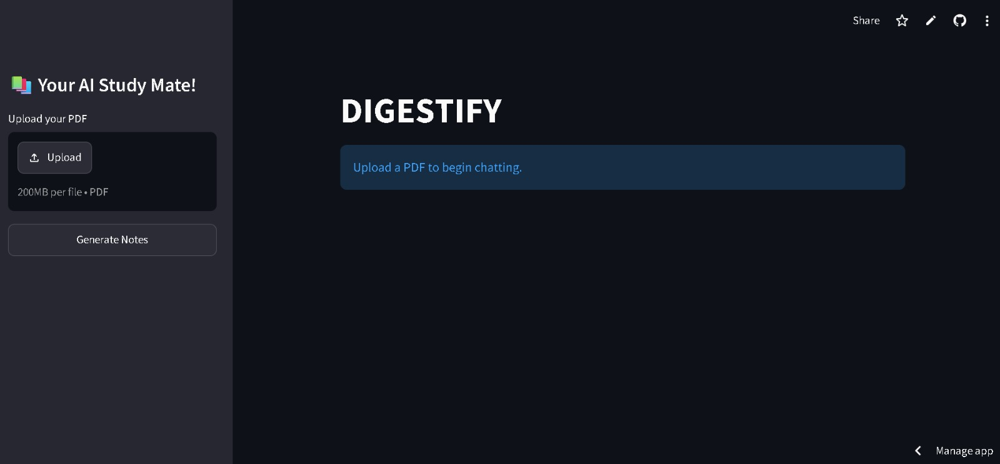
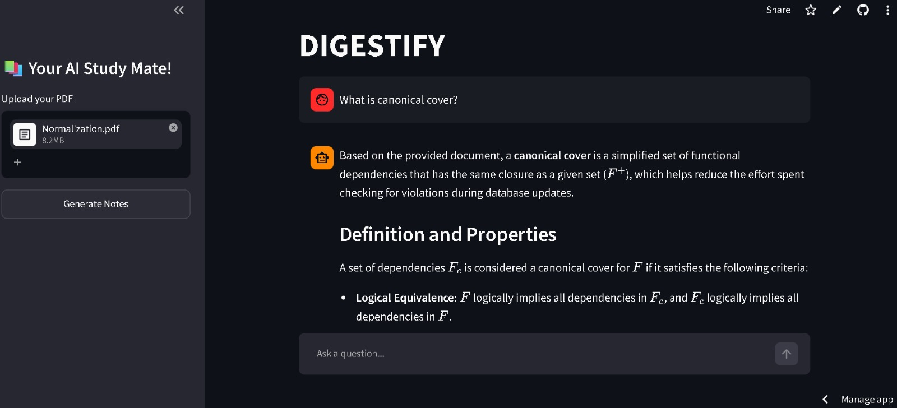
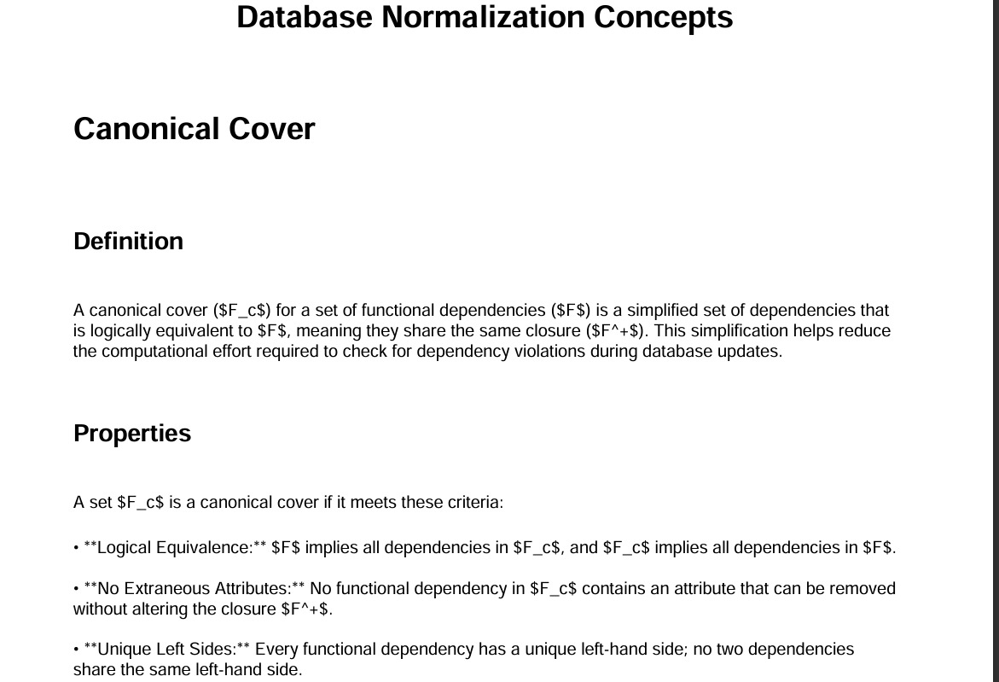

# DIGESTIFY 📚🤖

> AI-powered Study Assistant built from scratch using Retrieval-Augmented Generation (RAG).

Digestify is an end-to-end RAG-based study assistant that allows users to upload PDF study material, ask context-aware questions, retrieve the most relevant information using hybrid retrieval, generate structured AI-powered study notes from an entire learning session, and export those notes as a downloadable PDF.

---
## Home Page



---

## Ask Questions



---

## AI Generated Smart Notes



## Features

- 📄 PDF text extraction and preprocessing
- ✂️ Custom chunking with metadata preservation
- 🔍 LangChain Recursive Character Text Splitter comparison
- 🧠 SentenceTransformer embeddings
- 📌 Cosine similarity retriever
- ⚡ FAISS semantic search
- 🔎 BM25 keyword search
- 🤝 Hybrid Retrieval using Reciprocal Rank Fusion (RRF)
- 📊 Retrieval evaluation benchmark (Precision@5)
- 💬 Conversational chat interface
- 📚 Chat memory
- 🏷️ Source attribution (page number & chunk metadata)
- 🧩 Semantic question deduplication
- 📝 AI-powered Smart Notes generation
- 📄 PDF export of generated notes
- 🎨 Interactive Streamlit interface

---

## Project Pipeline


                     PDF Upload
                          │
                          ▼
                   PDF Parsing
                          │
                          ▼
                 Text Preprocessing
                          │
                          ▼
                 Custom Chunking
                          │
                          ▼
             Sentence Embeddings
                          │
                 ┌────────┴────────┐
                 ▼                 ▼
          Dense Retrieval      BM25 Retrieval
               (FAISS)
                 └────────┬────────┘
                          ▼
           Reciprocal Rank Fusion
                          ▼
              Top-K Relevant Chunks
                          ▼
              Gemini 2.5 Flash Lite
                          ▼
          Context-Aware Answer Generation
                          ▼
               Conversation History
                          ▼
      Semantic Question Deduplication
                          ▼
         AI Structured Notes Generation
                          ▼
              PDF Notes Export


---

# Tech Stack

### Language

- Python

### Frontend

- Streamlit

### LLM

- Google Gemini 2.5 Flash Lite API

### Retrieval

- Sentence Transformers
- FAISS
- rank-bm25

### PDF Processing

- PyPDF
- ReportLab

### ML / NLP

- scikit-learn
- NumPy

### Utilities

- Regex
- Collections
- dotenv

---

# Project Structure

```text
Digestify/

│
├── app.py
├── requirements.txt
├── README.md
│
├── src/
│   ├── pdfparser.py
│   ├── chunker.py
│   ├── langchain_chunker.py
│   ├── embeddings.py
│   ├── retriever.py
│   ├── faiss_retriever.py
│   ├── bm25_retriever.py
│   ├── hybrid_retriever.py
│   ├── llm.py
│   ├── evaluation.py
│   ├── notes_generator.py
│   ├── semantic_deduplication.py
│   └── pdf_export.py
│
├── notebooks/
│
└── assets/
```

---

# Completed Stages

## ✅ Stage 0 — RAG Fundamentals

Learned

- RAG Architecture
- Embeddings
- Dense vs Sparse Retrieval
- Vector Databases
- Hallucination Mitigation
- Hybrid Retrieval

---

## ✅ Stage 1 — Streamlit UI

Built

- Chat Interface
- Session State
- PDF Upload
- Notes Generation
- PDF Download

---

## ✅ Stage 2 — PDF Parsing

Implemented

- PDF extraction
- Text preprocessing
- Header/Footer removal
- Corpus generation
- Page-wise metadata

---

## ✅ Stage 3 — Chunking

Implemented

- Custom chunking
- Adjustable chunk size
- Adjustable overlap
- Metadata preservation

Compared against

- LangChain RecursiveCharacterTextSplitter

---

## ✅ Stage 4 — Embeddings

Model

```
all-MiniLM-L6-v2
```

Generated

- Chunk embeddings
- Query embeddings

---

## ✅ Stage 5 — Naive Retriever

Implemented

- Cosine Similarity Search
- Top-K Ranking

---

## ✅ Stage 6 — FAISS

Implemented

- Vector Index
- Semantic Search
- Efficient Nearest Neighbor Retrieval

---

## ✅ Stage 7 — Hybrid Retrieval

Implemented

- BM25
- FAISS
- Reciprocal Rank Fusion

---

## ✅ Stage 8 — Retrieval Evaluation

Created

- 20 manually labeled benchmark questions

Metric

- Precision@5

| Retriever | Precision@5 |
|------------|------------:|
| Naive Cosine | 0.75 |
| FAISS | 0.75 |
| BM25 | 0.65 |
| Hybrid | **0.75** |

---

## ✅ Stage 9 — LLM Integration

Implemented

- Gemini API integration
- Context-aware prompting
- Grounded answer generation
- System & user prompt separation

---

## ✅ Stage 10 — Source Attribution

Implemented

- Page citation
- Chunk metadata
- Source-aware answers

---

## ✅ Stage 11 — Chat Memory

Implemented

- Conversation history
- Multi-turn question answering

---

## ✅ Stage 12 — Semantic Question Deduplication

Implemented

- SentenceTransformer embeddings
- Cosine similarity matrix
- Threshold-based clustering

---

## ✅ Stage 13 — Smart Notes Generation

Implemented

- AI-generated structured notes
- Topic-wise clustering
- Markdown formatting

---

## ✅ Stage 14 — PDF Export

Implemented

- ReportLab integration
- Structured PDF generation
- One-click download

---

# What I Learned

Through building Digestify, I gained hands-on experience with

- Retrieval-Augmented Generation (RAG)
- Hybrid Retrieval Systems
- Dense & Sparse Retrieval
- Reciprocal Rank Fusion
- Sentence Embeddings
- FAISS Indexing
- BM25 Ranking
- Prompt Engineering
- Gemini API Integration
- Chat Memory
- Semantic Clustering
- PDF Parsing
- Retrieval Evaluation
- ReportLab PDF Generation
- End-to-End AI Application Development
- Streamlit State Management

---

# Future Improvements

- Cross Encoder Re-ranking
- Query Expansion
- Multi-PDF Chat
- Streaming Responses
- Source Highlighting
- Advanced Evaluation Metrics
- Knowledge Graph Integration

---

# Demo

(Add screenshots and deployment link here after deployment.)

---

# Status

## ✅ Current Progress

**Stage 14 / Stage 14 Completed**

🎉 Digestify is now a fully functional end-to-end RAG study assistant capable of answering questions from uploaded PDFs, generating structured study notes, and exporting them as downloadable PDFs.